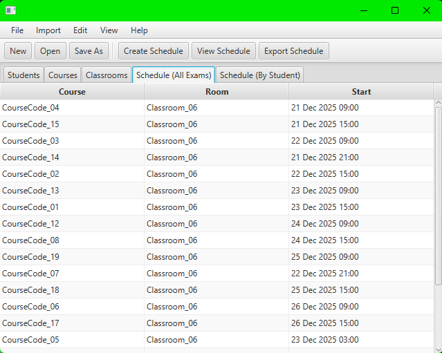

# Exam Scheduler

A desktop application developed for the **SE302 Software Engineering** course to help instructors create exam timetables without conflicts.

---

## About the Project

Exam Scheduler is a standalone desktop application designed to generate exam schedules for a fixed exam period. The system takes course information, student registrations, and classroom data as input and produces an exam timetable that respects common academic constraints.

All data is provided by the user through import files and can be reviewed or edited before scheduling. The generated schedule can also be adjusted manually if needed. The application runs locally on Windows and does not rely on any external services.

---

## What the System Does

- Imports course, student, and classroom data from **CSV files**
- Allows users to edit imported data before scheduling
- Automatically generates an exam schedule
- Checks for common scheduling conflicts
- Provides different ways to view the schedule
- Allows manual changes to the generated schedule
- Saves and loads schedules for later use

---

## Scheduling Logic

The scheduling process is implemented using a **greedy approach**. Exams are placed one by one into available days, time slots, and classrooms.  
During placement, the system checks all constraints to ensure that:

- Students do not have overlapping exams
- Students do not have exams in consecutive time slots
- Students do not have more than two exams in one day
- Classroom capacities are sufficient

If no valid placement is possible under the given conditions, the system informs the user that no solution exists.

---

## Technologies Used

- **Java**
- **JavaFX** for the user interface
- **CSV files** for data input
- **Object serialization** for saving and loading schedules

---

## Platform

- Operating System: **Windows**
- Interface Language: **English**
- Application Type: **Standalone desktop application**

---

## Screenshots

Screenshots of the application interface and generated schedules.

